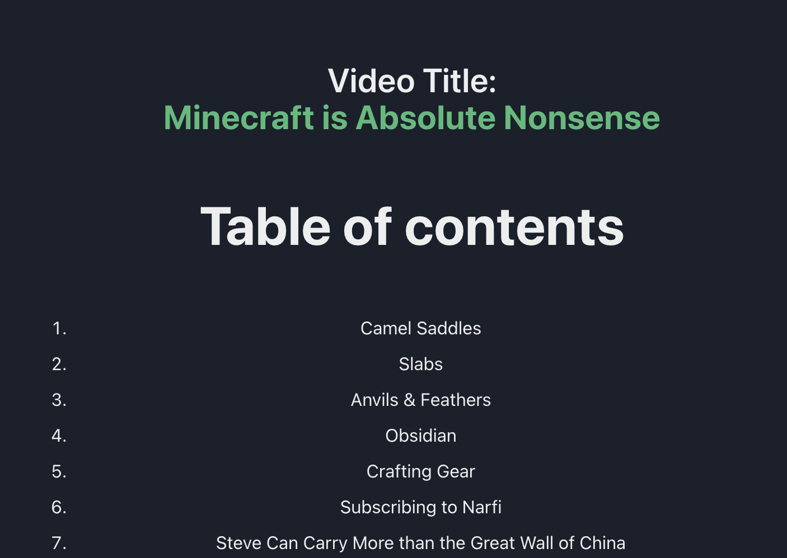

# iSpyAI

## Introduction

Welcomee to iSpyAI! Our project is a web application and distributed system that allows users to convert their favorite Youtube Videos into a full blog post.

The application is built using the a multitude of different technologies. The backend is split between a flask server and node server. The flask server is responsible for handling the video processing and the node server is responsible for handling the blog post generation. The frontend is built using React and is responsible for handling the user interface and user experience.

## Note

`ispyai-node-wrapper` is unused

## Usage

1. Navigate to the application in your browser

-   http://ispyai.onrender.com

2. Enter a Youtube URL and click submit

3. Wait for the video to process

> Once the video has been processed, you will be redirected to the blog post page. The blog post page will contain the video title, and the blog post content. There will also be any relevant images or code snippets that were generated from the video.

